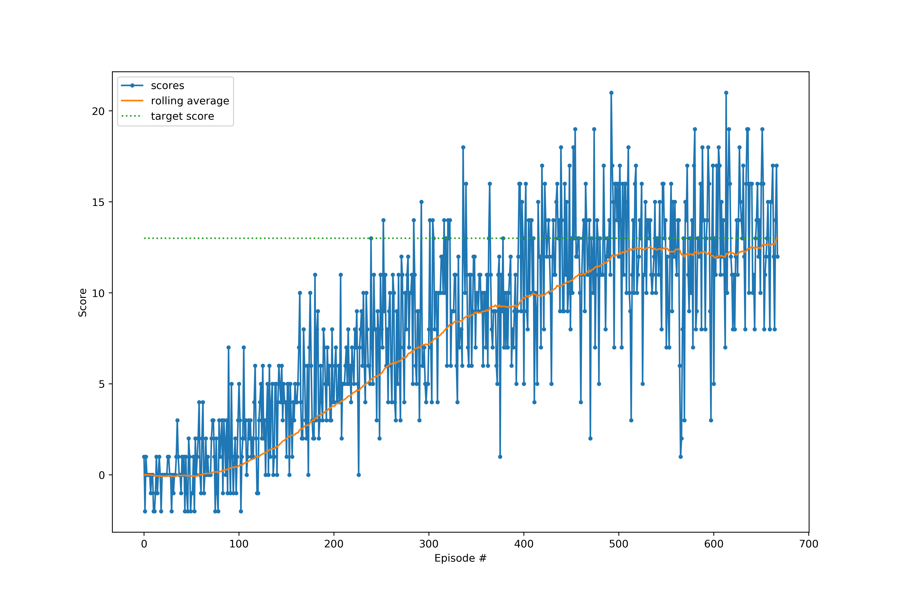

# Project 1: Navigation

This is the report for the first project in Udacity Deep Learning
specialisation. The report summarizes the solution of the Navigation project.

## Results

The environment was solved in 568 episodes.
The agent scores along with rolling average is seen in the figure below:

We see a fast rise for about 500 episodes up to an average score of about 12,
then the agent transitions to a slower learning rate for a few episodes until
it solves the environment at a score of 13.

## Learning Algorithm

The learning algorithm used is Q-learning with soft-update and an experience
replay buffer.

### Hyper-parameters

Agent hyper parameters were not tuned significantly. They were chosen close to
the values used in [1]:

	Buffer_size = 1e5
	batch_size = 32
	gamma = 0.98
	tau = 7e-4
	lr = 4e-4
	epsilon_start = 1
	epsilon_end = 0.01
	epsilon_decay = 0.996

### Neural Netowrks

The neural network used in the QNetwork is a fully connected 4 layer network
with 128 neurons in each layer. In addition, each layer is connected to the
input neurons, e.g.:

	Input(state)  ---> Layer1 --> Layer 2  ----> Layer 3 ...  Layer N---> Output(action)
	    \   \___________________/               /             /
	     \_____________________________________/	         /

This means that layer 1 has 128 neurons, while layers 2 - 4 has 128 neurons +
the number of input parameters (37). So in total layers 2-4 have 165 neurons. 

The output is normalized to the target_score to keep the expected reward close to 1.

The network used resembles residual networks, which have shortcut
connections of similar nature. These shortcuts are made to avoid diminishing
gradients, and aids in training a deeper neural network effeciently.

## Future Work

During the exploration track I found on several occasions, that the agent had a
hard time picking up speed on training. In particular, it seemed that for a
long time, episodes with 0 reward kept appearing. It would be interesting to
check whether prioritized experience replay could avoid such episodes, or even
improve learning speed. 

It would also be a blast to try different methods for getting the overall
highest performance, not just beating a score of 13, but trying to maximise the
overall score, say on a 2000 episode training run. Here it would be possible to
benchmark different algorithm improvements against each other, fx Double DQN [2] or
dueling DQN [3], or mixtures of these with/without prioritized experience replay.

# References

[1] Mnih, V., Kavukcuoglu, K., Silver, D. et al. Human-level control through deep reinforcement learning. Nature 518, 529–533 (2015). https://doi.org/10.1038/nature14236

[2] van Hasselt, H. et al. Deep Reinforcement Learning with Double Q-learning. arXiv:1509.06461

[3] Wang, Z. et al. Dueling Network Architectures for Deep Reinforcement Learning. arXiv:1511.06581
